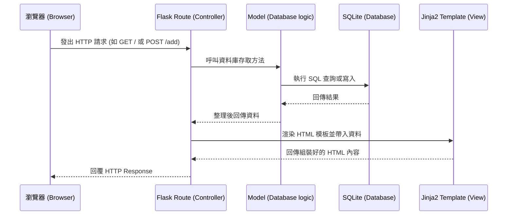

# 系統架構設計: 讀書筆記本 (Reading Notebook)

## 1. 技術架構說明
本專案採用輕量級的技術堆疊，適合快速原型開發與個人專案使用：
- **後端框架**：Python + Flask
  - 選擇原因：Flask 是一個輕量且彈性的 WSGI web application 框架，非常適合用於中小型應用。
- **模板引擎**：Jinja2
  - 選擇原因：與 Flask 原生整合，負責渲染前端 HTML 頁面，不需前後端分離，降低了初期開發與維護的複雜度。
- **資料庫**：SQLite
  - 選擇原因：不需額外架設資料庫伺服器，檔案型資料庫便於備份與攜帶，對於本專案的資料量（個人筆記記錄）已經非常足夠。

### Flask MVC 模式說明
- **Model (資料模型)**：負責定義資料結構與處理與 SQLite 資料庫的各項互動 (CRUD)，確保資料的一致性與安全。
- **View (視圖)**：Jinja2 模板負責產生要在瀏覽器中展示的 HTML，單純只負責呈現，不處理商業邏輯。
- **Controller (控制器)**：Flask 的 Route 負責處理 HTTP 請求、呼叫 Model 取得或寫入資料、判斷邏輯後，再把結果交給 View (Jinja2) 來渲染並回傳給使用者。

## 2. 專案資料夾結構

```text
讀書筆記本專案/
├── app/                  # 應用程式核心資料夾
│   ├── models/           # 處理資料庫結構定義及資料存取邏輯
│   ├── routes/           # 定義 Flask 的 URL 路由以及與使用者的互動邏輯
│   ├── templates/        # 存放所有 Jinja2 HTML 模板
│   └── static/           # 靜態資源（CSS 樣式表、JavaScript、圖片等）
├── instance/             # 存放不需要進版控的本地檔案（如資料庫）
│   └── database.db       # SQLite 資料庫檔案
├── docs/                 # 放置 PRD、架構文件等開發說明
│   ├── PRD.md
│   └── ARCHITECTURE.md
├── app.py                # 應用程式啟動點（入口檔案）
└── requirements.txt      # Python 本專案依賴套件清單
```

## 3. 元件關係圖



## 4. 關鍵設計決策

1. **不採前後端分離架構**
   - **原因**：為了在最短時間內提供能展示核心價值的 MVP，節省開發獨立前端框架（如 React/Vue）以及設計 RESTful API 的成本。使用 Flask 內建的路由與 Jinja2 就能滿足所有需求。
2. **採用 SQLite 嵌入式資料庫**
   - **原因**：減少維護並管理資料庫伺服器（如 MySQL/PostgreSQL）的負擔。SQLite 直接寫入本地檔案，這對於個人的「讀書筆記本」已經完全足夠且便於資料備份。
3. **基礎安全防護實作機制**
   - **原因**：為了防止 XSS 與 SQL Injection 攻擊。使用 Jinja2 預設的自動跳脫 (autoescaping) 可防禦多數 XSS 攻擊；資料庫存取一律使用 Prepared Statement 或 ORM (如 SQLAlchemy) 來防止 SQL Injection 攻擊，提升系統安全性。
