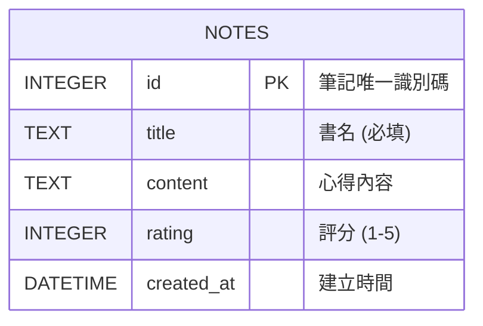

# 資料庫設計: 讀書筆記本 (Reading Notebook)

## 1. ER 圖（實體關係圖）
本系統核心為「讀書筆記」(notes)，目前為 MVP 狀態，因此僅需要一張核心資料表。

## 2. 資料表詳細說明

### `notes` (讀書筆記)
用來儲存使用者的每一筆讀書筆記紀錄。

| 欄位名稱 | 型別 | 屬性 | 說明 |
| :--- | :--- | :--- | :--- |
| `id` | INTEGER | PRIMARY KEY, AUTOINCREMENT | 筆記的唯一 ID，自動遞增 |
| `title` | TEXT | NOT NULL | 書籍名稱，用於列表顯示與搜尋 |
| `content` | TEXT | NULL | 閱讀心得與筆記內文 |
| `rating` | INTEGER | NULL | 評分（預計範圍：1至5） |
| `created_at` | DATETIME| DEFAULT CURRENT_TIMESTAMP | 筆記的建立時間 |

## 3. SQL 建表語法
對應的建表語法已經產出至 `database/schema.sql` 中。這段語法可以直接用於 SQLite 初始化。

## 4. Python Model 程式碼
對應的 Python Model (負責對 `notes` 表進行 CRUD 及搜尋操作) 已儲存於 `app/models/note.py` 中，使用 Python 內建的 `sqlite3` 即可滿足需求。
