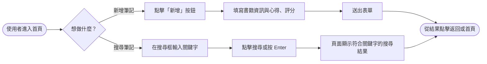
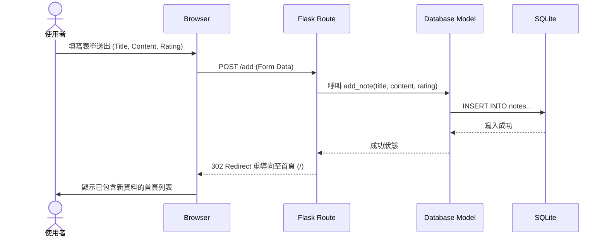
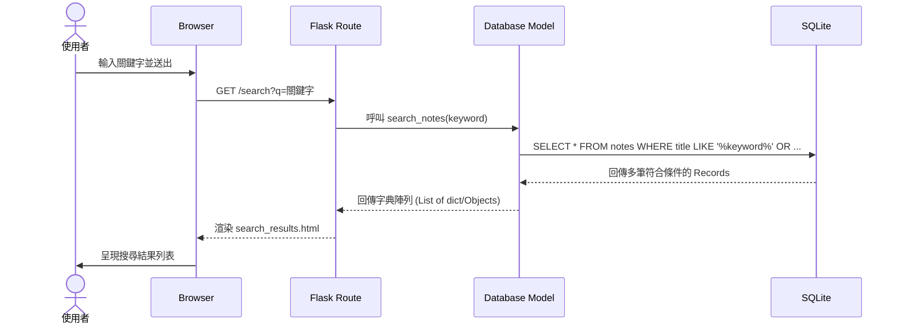

# 流程圖設計: 讀書筆記本 (Reading Notebook)

## 1. 使用者流程圖（User Flow）
此流程圖描述使用者在系統中「新增筆記」與「搜尋筆記」的操作路徑。

## 2. 系統序列圖（Sequence Diagram）
描述「新增筆記」與「搜尋筆記」背後的系統互動流程，包含瀏覽器與 Flask MVC 之間的資料流動。

### 2.1 新增筆記流程

### 2.2 搜尋筆記流程

## 3. 功能清單對照表

| 功能名稱 | 對應 URL 路徑 | HTTP 方法 | 功能說明 |
| :--- | :--- | :--- | :--- |
| **首頁列表** | `/` | `GET` | 讀取所有筆記並渲染列表畫面 |
| **新增頁面** | `/add` | `GET` | 顯示新增表單頁面（如需獨立頁面，亦可實作於首頁對話框） |
| **新增處理** | `/add` | `POST` | 接收新增表單內的資料並寫入資料庫 |
| **搜尋筆記** | `/search` | `GET` | 讀取 URL 參數 `?q=` 執行模糊搜尋並顯示結果 |
